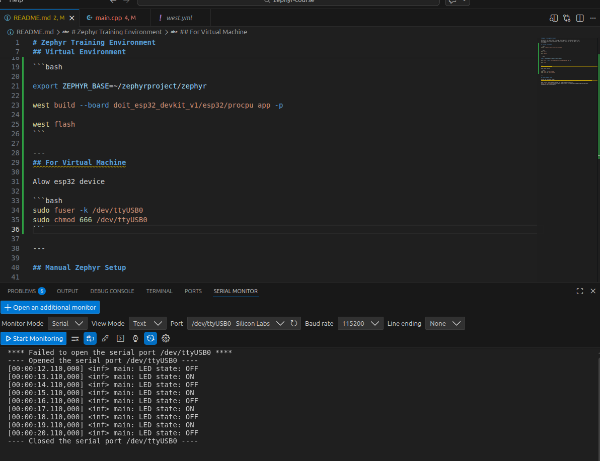

# Zephyr Training Environment

Welcome to the Zephyr RTOS training! This repository includes a ready-to-use
development environment based on Zephyr 4.3.0, which you can set up in one of
three ways:

## Virtual Environment

```bash
source ~/zephyrproject/.venv/bin/activate
```

```bash
west init -l

west update
```

```bash

export ZEPHYR_BASE=~/zephyrproject/zephyr

west build --board esp32_devkitc_wroom/esp32/procpu app -p

west flash
```

---

## For WSL


run the folowing comands on Powershell:
```PowerShell
usbipd list # to identify the device

usbipd bind --busid 1-1 # to bind the device

usbipd attach --wsl --busid 1-1 # to attach the device to WSL

```
on WLS run to check the device:

```bash
ls -la /dev/ttyUSB0
```


## For Virtual Machine

Alow esp32 device

```bash
sudo fuser -k /dev/ttyUSB0
sudo chmod 666 /dev/ttyUSB0
```

---
## Results



blinky sample


---

## Manual Zephyr Setup

Follow the following guide:
- [Getting Started Guide](https://docs.zephyrproject.org/latest/develop/getting_started/index.html#).

Make sure to select appropriate OS and to perform all steps till
[Build the Blinky Sample](https://docs.zephyrproject.org/latest/develop/getting_started/index.html#build-the-blinky-sample).
