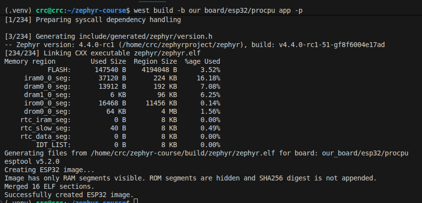

# Zephyr Training Environment

Welcome to the Zephyr RTOS training! This repository provides a ready-to-use development environment based on Zephyr 4.3.0. You can set up the environment using one of the following methods.

**Additional Resources:** [Zephyr Training Tasks](https://iomico.atlassian.net/wiki/external/OTFlYTBiYmVjYjU5NGY2M2IyOWJhNGY4ZTQxZWM5ODg)

## Virtual Environment

First, activate the virtual environment:

```bash
source ~/zephyrproject/.venv/bin/activate
```

Initialize and update the workspace:

```bash
west init -l
west update
```

Build and flash the application:

```bash
export ZEPHYR_BASE=~/zephyrproject/zephyr
west build --board esp32_devkitc/esp32/procpu app -p
west flash
```

To configure the build with menuconfig:

```bash
west build -t menuconfig
```

> **Note:** The board will be automatically selected from the `BOARD` environment variable. Make sure to set it before building.

---

## Windows Subsystem for Linux (WSL)

Run the following commands in PowerShell to set up USB device forwarding:

```powershell
usbipd list           # Identify the device
usbipd bind --busid 1-1     # Bind the device
usbipd attach --wsl --busid 1-1   # Attach the device to WSL
```

On WSL, verify the device is available:

```bash
ls -la /dev/ttyUSB0
```

## Virtual Machine

To allow the ESP32 device access, run:

```bash
sudo fuser -k /dev/ttyUSB0
sudo chmod 666 /dev/ttyUSB0
```

---

## Kconfig (Menuconfig)

To access the Kconfig menuconfig tool:

```bash
west build -t menuconfig
```


---

## Results

Initial flash output:


Blinky sample running:


---

## Manual Zephyr Setup

For a complete manual setup, follow the official [Getting Started Guide](https://docs.zephyrproject.org/latest/develop/getting_started/index.html).

Ensure you:

- Select the appropriate operating system for your platform
- Complete all setup steps through the [Build the Blinky Sample](https://docs.zephyrproject.org/latest/develop/getting_started/index.html#build-the-blinky-sample) section

## Homework & Resources

1. What is Zephyr/Preparing dev environment?

Trainees shall:

- set development environment
- Build a Hello World example
- flash the example

[Getting Started Guide — Zephyr Project Documentation](https://docs.zephyrproject.org/latest/develop/getting_started/)

[Zephyr SDK — Zephyr Project Documentation](https://docs.zephyrproject.org/latest/develop/toolchains/zephyr_sdk.html)

2. West, west topologies, Hello World

- Fork and set up the provided workspace — https://github.com/iomico-public/zephyr-course
- Build and run an LED blink application (if there's an LED on your board)
    - Flash to your hardware board
    - Verify the LED toggles every second
    - Push tag: l2-task1

[West (Zephyr’s meta-tool) — Zephyr Project Documentation](https://docs.zephyrproject.org/latest/develop/west/)

[West Manifests — Zephyr Project Documentation](https://docs.zephyrproject.org/latest/develop/west/)

[Application Development — Zephyr Project Documentation](https://docs.zephyrproject.org/latest/develop/application/index.html)

[Zephyr SDK — Zephyr Project Documentation](https://docs.zephyrproject.org/latest/develop/toolchains/zephyr_sdk.html)

3. App Configuration: Kconfig

- Reproduce this menu structure in your `Kconfig`
- ```shell
  [*] LED Subsystem  --->
     LED blink sleep time (1s (medium))  --->
     [ ] Advanced LED settings  --->
          (100) LED brightness (0-100)
          (500) LED fade duration (ms)
          Expert settings  --->
               [ ] Enable LED debugging
               [ ] Custom blink pattern
  ```
    - **menuconfig** for LED Subsystem (top-level toggle)
    - **choice** for blink sleep time (250ms, 500ms, 1s, 2s) with hidden int symbol
    - **menuconfig** for Advanced LED settings
    - **menu** with **visible if** for Expert settings
    - **range** for brightness (0-100) and fade (0-5000)
- Push tag l3-task1

[Kconfig Tips](https://docs.zephyrproject.org/latest/build/kconfig/tips.html#select-pitfalls)

4. App Configuration: Devicetree

Add a configurable heartbeat LED to the blinky app from the demo.

- Create `app.overlay` — add alias `app-led` pointing to your board's `led0`
- Add `Kconfig` file with;
- `int APP_HEARTBEAT_PERIOD_MS` (default `500`, range `100`–`2000`)
- In C: use `DT_ALIAS(app_led)` for the GPIO and `CONFIG_APP_HEARTBEAT_PERIOD_MS` for the sleep duration
- Verify: open `menuconfig`, change the period, rebuild — LED blink speed must change
- Push tag: `l4-task1`

[Devicetree — Zephyr Project Documentation](https://docs.zephyrproject.org/latest/build/dts/)

[Devicetree HOWTOs — Zephyr Project Documentation](https://docs.zephyrproject.org/latest/build/dts/howtos.html)

[Configuration System (Kconfig) — Zephyr Project Documentation](https://docs.zephyrproject.org/latest/build/kconfig/)

5. Custom Boards

### Task 1

- Create a custom board using the "Copy/Rename" method.
- Build the hello world sample for said board. 
- Place the board directory in `<project_root>/boards/`.
- Push and tag it as l5-task1.



### Task 2

- Create a custom board using the "From Scratch" method.
- Build the hello world sample for said board.
- It must also print a message ("Board Initialized") before entering the main entry point of the application.
- Push and add tag it as l5-task2.

[Supported Boards and Shields — Zephyr Project Documentation](https://docs.zephyrproject.org/latest/boards/index.html#boards)

[Board Porting Guide — Zephyr Project Documentation](https://docs.zephyrproject.org/latest/hardware/porting/board_porting.html)

[Devicetree — Zephyr Project Documentation](https://docs.zephyrproject.org/latest/build/dts/index.html)

6. Driver Development

### Task 1

- Create a sensor driver following the structure shown in this lecture.
The sensor will be a simple on-board led.
- The driver should implement `sensor_sample_fetch` and `sensor_channel_get`, turning on/off the led, respectively.
- Commit and tag it l6-task1.

### Task 2

- Add a custom extension API function to your driver
- Call it from `main.c`. 
- This function will change a parameter of your choosing in the dynamic data struct.
- Commit and tag it l6-task2.

[Modules (External projects) — Zephyr Project Documentation](https://docs.zephyrproject.org/latest/develop/modules.html)

[Devicetree bindings — Zephyr Project Documentation](https://docs.zephyrproject.org/latest/build/dts/bindings.html)

[Device Driver Model — Zephyr Project Documentation](https://docs.zephyrproject.org/latest/kernel/drivers/index.html)