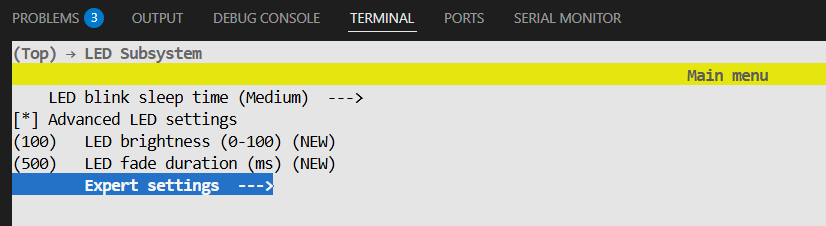
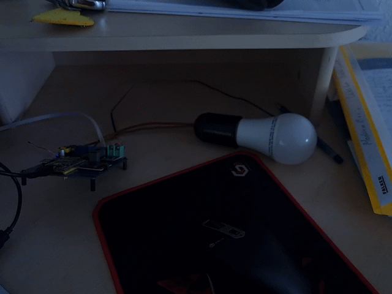

# Zephyr Training Environment

Welcome to the Zephyr RTOS training! This repository provides a ready-to-use development environment based on Zephyr 4.3.0. You can set up the environment using one of the following methods.

**Additional Resources:** [Zephyr Training Tasks](https://iomico.atlassian.net/wiki/external/OTFlYTBiYmVjYjU5NGY2M2IyOWJhNGY4ZTQxZWM5ODg)

## Virtual Environment

First, activate the virtual environment:

```bash
source ~/zephyrproject/.venv/bin/activate
```

Initialize and update the workspace:

```bash
west init -l
west update
```

Build and flash the application:

```bash
export ZEPHYR_BASE=~/zephyrproject/zephyr
west build --board esp32_devkitc/esp32/procpu app -p
west flash
```

To configure the build with menuconfig:

```bash
west build -t menuconfig
```

> **Note:** The board will be automatically selected from the `BOARD` environment variable. Make sure to set it before building.

---

## Windows Subsystem for Linux (WSL)

Run the following commands in PowerShell to set up USB device forwarding:

```powershell
usbipd list           # Identify the device
usbipd bind --busid 1-1     # Bind the device
usbipd attach --wsl --busid 1-1   # Attach the device to WSL
```

On WSL, verify the device is available:

```bash
ls -la /dev/ttyUSB0
```

## Virtual Machine

To allow the ESP32 device access, run:

```bash
sudo fuser -k /dev/ttyUSB0
sudo chmod 666 /dev/ttyUSB0
```

---

## Kconfig (Menuconfig)

To access the Kconfig menuconfig tool:

```bash
west build -t menuconfig
```



---

## Results

Initial flash output:


Blinky sample running:



---

## Manual Zephyr Setup

For a complete manual setup, follow the official [Getting Started Guide](https://docs.zephyrproject.org/latest/develop/getting_started/index.html).

Ensure you:
- Select the appropriate operating system for your platform
- Complete all setup steps through the [Build the Blinky Sample](https://docs.zephyrproject.org/latest/develop/getting_started/index.html#build-the-blinky-sample) section
